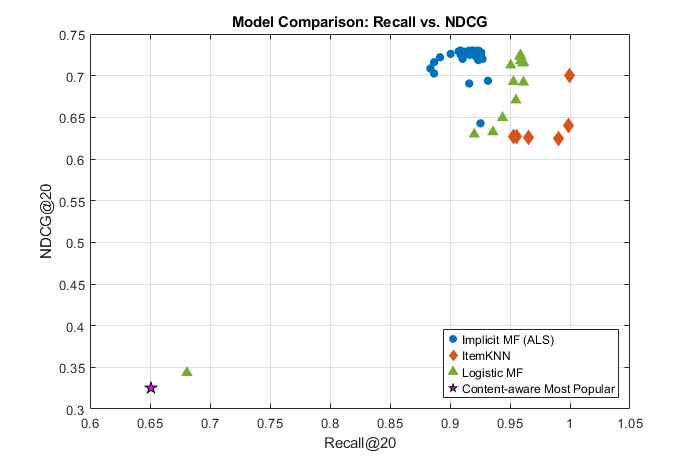

# Yelp Recommendation System

A MATLAB-based exploration of recommendation algorithms using Yelp dataset features. Included methods cover collaborative filtering (implicit), logistic regression, and popularity-based recommendations.

## Table of Contents
- [Overview](#overview)
- [Structure](#structure)
- [Setup](#setup)
- [Results](#results)

## Overview
This repository contains MATLAB implementations of recommendation strategies using Yelp data:
- **Implicit**: Collaborative filtering model (implicit feedback)
- **Logistic Regression**: Predicting user preferences
- **ItemKNN**: Item-based K-Nearest Neighbors collaborative filtering (item similarity)
- **MostPopular**: Baseline popularity-based ranking

Includes data preprocessing, evaluation workflow, and result visualization.

## Structure
- `run_preprocessing.mlx` – Data loading and preprocessing pipeline  
- `Implicit_main.mlx` – Implicit MF implementation
- `logistic_main.mlx` – Logistic MF implementation  
- `itemknn_main.mlx` – Item-based KNN recommender  
- `mostpop_main.mlx` – Popularity-based recommendation baseline  
- `evaluate.mlx` – Evaluation routines and metrics  
- `final results.png` – Visual comparison of model performances  

## Setup Requirements
- MATLAB R2024 (with Statistics and Machine Learning Toolbox)

### Running the code
0. you have to uncomment the 'run_preprocessing' line from each main file when you want to run the preprocessing
1. Run each model script (`Implicit_main.mlx`, etc.) to train and evaluate.

## Results
The evaluation outputs are summarized below:

**Comment:**  
Both matrix factorization models (Implicit and logistic) were optimized using Bayesian Optimization to fine-tune their hyperparameters. This process improved model performance, achieving better recall@20 and NDCG@20. The results show that carefully tuned hyperparameters can significantly enhance recommendation accuracy.
